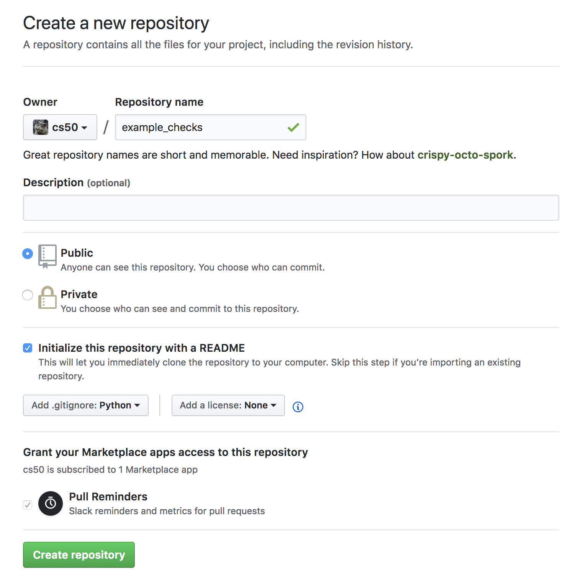
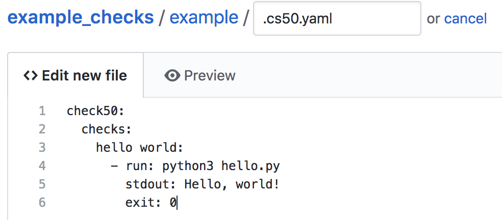

# check50 [](https://www.travis-ci.org/cs50/check50)

Check50 is a testing tool for checking student code. As a student you can use check50 to check your CS50 problem sets or any other Problem sets for which check50 checks exist. Check50 allows teachers to automatically grade code on correctness and to provide automatic feedback while students are coding.

## Installation
First make sure you have Python 3.6 or higher installed. You can download Python [here](https://www.python.org/downloads/).

Check50 has a dependency on git, please make sure to [install git](https://git-scm.com/book/en/v2/Getting-Started-Installing-Git) if git is not already installed.

To install check50 under Linux / OS X:

    pip install check50

Under Windows, please [install the Linux subsystem](https://docs.microsoft.com/en-us/windows/wsl/install-win10). Then install check50 within the subsystem.

## Checks
In Check50 the actual checks are decoupled from the tool. You can find CS50's set of checks for CS50 problem sets at [/cs50/checks](https://github.com/cs50/checks). If you would like to develop your own set of checks such that you can use check50 in your own course [jump to writing checks](#writing-checks).

Under the hood, checks are naked Python functions decorated with the ``` @check50.check``` decorator. Check50 exposes several functions, [documented below](#docs), that allow you to easily write checks for input/output testing. Check50 comes with two builtin extensions: `c` and `flask`. These extensions add extra functionality for C and Python's Flask framework to check50's core.

By design check50 is extensible. If you want to add support for other programming languages / frameworks and you are comfortable with Python please [check out writing extensions](#writing-extensions).

## Usage

## Docs

`check50.check`

`check50.exists`

`check50.run`

`check50.Process.stdin`

`check50.Process.stdout`

`check50.Process.exit`

`check50.Process.reject`

`check50.Process.kill`

`check50.Failure`

`check50.Mismatch`

`check50.diff`

`check50.hash`

`check50.log`

`check50.include`

`check50.import_checks`

## Writing checks
Check50 checks live in a git repo on Github. Check50 finds the git repo based on the slug that is passed to check50. For instance, consider the following execution of check50:

    check50 cs50/problems/2018/x/hello

Check50 will look for an owner called `cs50`, a repo called `problems`, a branch called `2018` or `2018/x` and a problem called `x/hello` or `hello`. The slug is thus parsed like so:

    check50 <owner>/<repo>/<branch>/<problem>

### Creating a git repo
To get you started, the first thing you need to do is [register with Github](https://github.com/join). Once you have done so, or if you already have an account with Github, [create a new git repo](https://github.com/new). Make sure to think of a good name for your repo, as this is what students will be typing. Also make sure your repo is set to public, it is initialised with a README, and finally add a Python `.gitignore`. Ultimately you should have something looking like this:



### Creating a simple (YAML) check

Your new repo should live at `https://github.com/<user>/<repo>`, which is `https://github.com/cs50/example_checks` in our example. Once you have created your new repo, create a new file by clicking the new file button:


Then continue by creating the following `.check50.yaml` file. All indentation is done by 2 spaces, as per `.yaml` syntax.



Or in text, if you want to quickly copy-paste:

    checks:
      hello world:
        - run: python3 hello.py
          stdout: Hello, world!
          exit: 0

Note that you should create a directory like in the example above by typing: `example/.check50.yaml`. Once you have populated the file with the code above. Scroll down the page and hit the commit button:


That's it! You know have a repo that check50 can use to check whether a python file called `hello.py` prints `Hello, world!` and exits with a `0` as exit code. To try it, simply execute:

    check50 <owner>/<repo>/master/example --local

Where you substitute `<owner>` for your own username, `<repo>` for the repo you've just created. Given that a file called `hello.py` is in your current working directory, and it actually prints `Hello, world!` when run, you should now see the following:

    :) hello world

### Simple YAML checks

### Python checks

## Writing extensions

### check50.internal
